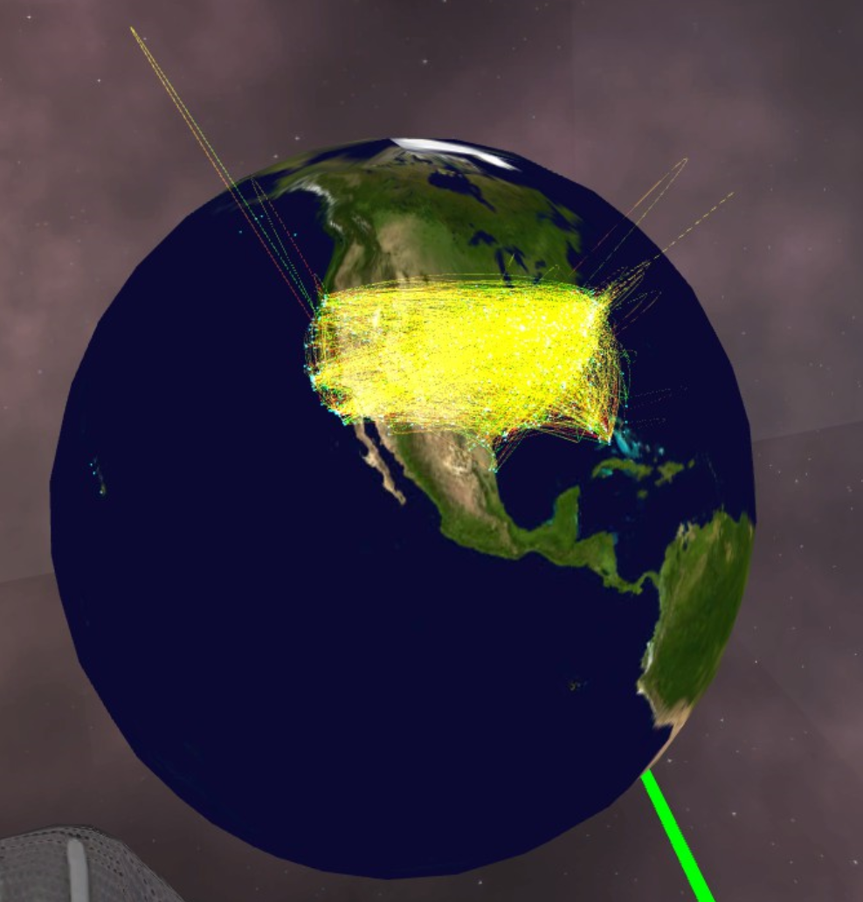

# immersive path planning

UPS have been considering new ways of exploring data to make operational decisions. Immersive data analytics utilizing virtual reality (VR) technology could be the way of the future, and our project sets out to demonstrate its capabilities and real-world applications. The goal of the project is to create a visualization program to facilitate analysis and decision
making based on large package flow data sets, using new immersive analytics technology. We have reviewed various techniques that may help us to proceed. These include current 2D visualizations such as flow maps with flow bundling, OD maps, and Flowstrates, as well
as immersive toolkits and dynamic approaches to handling large amounts of time-based
data.  

## Getting Started
### Prerequisites
The following packages and software should be installed in order to run our program
- Unity 2018.4.x version
- SteamVR

## Developer components
### Data format
The main input data format we use is json. We receive the data and convert them into an array in C#
```csharp
TextAsset stateData = Resources.Load<TextAsset>("fullstate");
string stateJson = stateData.text;
state = JsonUtility.FromJson<SeriesLocArray>(stateJson);
Visualizer.initialiseState(state.AllData);
```
### Data source
The original data stored in csv file and we have scripts to convert it into json format. So it is easy to import own data into\
out project
```python
import csv  
import json  
import pandas as pd
# Open the CSV  
f = open( 'arc_small.csv', 'rU' )  
# Change each fieldname to the appropriate field name. 
reader = csv.DictReader( f, fieldnames = ( "SLIC","ox","oy","OSLIC","DSLIC","VOL","dx","dy","VOL_LEVEL=" ))  
# Parse the CSV into JSON  
out = json.dumps( [ row for row in reader ] )  
print ("JSON parsed!"  )
# Save the JSON  
f = open( 'vol_parsed.json', 'w')  
f.write(out)  
```

## User Guide
### General User Interface

We simulate a full USA map with each state choosable. Each state will have a specific colour and it will change colour when it is selected.\Click on an active state will cancel it.


Global can be scaled but not rotated because the only area we need is America. The arcs will be visualized here.
The nodes represent the facility such as hub or center. These are important locations in the UPS network. 


Arc represents the flow. Color marks the origin and destination: yellow is the origin and red is the destination. Height shows the volume in the path.

### User Interaction

User can grab a wand each hand to select the node. It is easy to choose as the logic is toggleEnter which means user can hover the points and then it will be chosen. There is a window to show the details of target facility near the wand.


It is used to select the state


## Authors

* **Jianan Yang** - *Initial work* - [JiananYang](https://github.com/wemonster)
* **Andrew Gammon** - *Initial work* - [Andrew Gammon](https://github.com/Azdares)
* **Siyuan Yan** - *Initial work* - [Siyuan Yan](https://github.com/redlessme)
